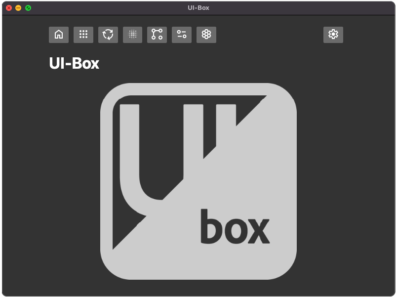

# UI-Box
___

A simple UI-sandbox/playground built with Electron and React

___

    

___

### Refs and links to check out

https://github.com/daltonmenezes/electron-app

https://github.com/reZach/secure-electron-template

https://www.youtube.com/watch?v=kN1Czs0m1SU

https://github.com/nklayman/electron-multipage-example

https://github.com/swiftyapp/swifty

https://github.com/szwacz/electron-boilerplate

https://www.freecodecamp.org/news/building-an-electron-application-with-create-react-app-97945861647c/