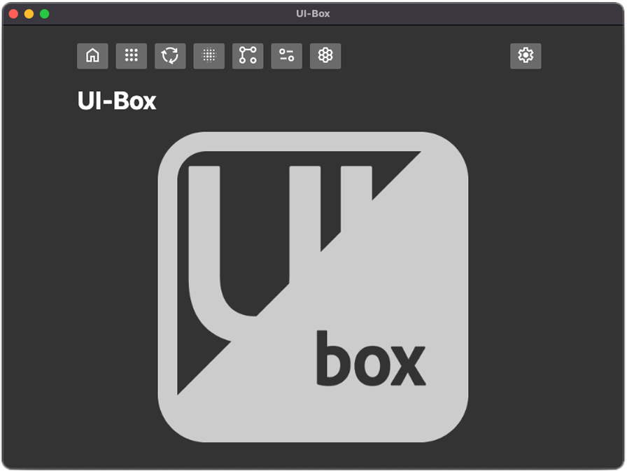

# UI-Box
___

A simple UI-sandbox/playground built with Electron and React

___

### <ins>Todo:</ins>

- **Pages + Functionality**

  - [x] **Particles**
    - [x] Figure out why mouse isnt at center 
    - [x] Fix font not displaying
    - [x] Fix canvas size

  - **Spinner**
    - [x] Figure out if possible
    - [x] Mousewheel
    - [x] Add velocity and friction

  - [ ] **Buttons**
    - [x] Smoother animations
    - [ ] Effects onpress

  - [ ] **More examples**
    - [ ] yo-yo thing?

- **Styles + Design**

  - [ ] **Navbar & Menus**
    - [ ] Navbar better style
    - [x] Icons instead of text

  - [ ] **Logo**
    - [ ] Fix/Design better logo
    - [ ] Banner for readme
    - [x] Center on page

- **General/QOL**
  - [x] Fix content centered in the middle of screen
  - [ ] Page transitions
  - [x] Working darkmode toggle

___
### Refs and links to check out

https://github.com/daltonmenezes/electron-app

https://github.com/reZach/secure-electron-template

https://www.youtube.com/watch?v=kN1Czs0m1SU

https://github.com/nklayman/electron-multipage-example

https://github.com/swiftyapp/swifty

https://github.com/szwacz/electron-boilerplate

https://www.freecodecamp.org/news/building-an-electron-application-with-create-react-app-97945861647c/